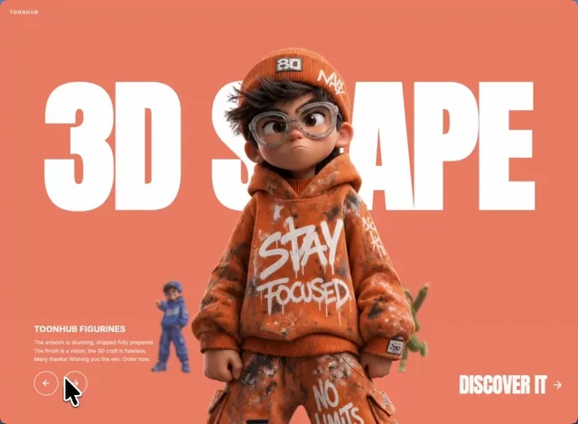

# 🎬 ToonHub  3D Animated Character Carousel

A sleek, interactive **3D collectible hero carousel** built with React, Vite, TypeScript, and Tailwind CSS. Designed for showcasing animated toon/character assets with smooth 3D transitions and a polished UI.

> 🔗 Live Preview: [motionsites.ai/3d-collectible-hero](https://motionsites.ai/?prompt=3d-collectible-hero)
> 📦 Repository: [github.com/cmokehleza/3d-animated](https://github.com/cmokehleza/3d-animated)

---

## 🎥 Demo



---

## ✨ Features

- 🎠 **3D Character Carousel**  Smooth, perspective-based card rotation with depth
- 🃏 **Collectible Hero Cards**  Display character stats, rarity, and animated highlights
- ⚡ **Blazing Fast**  Powered by Vite 7 with single-file build output
- 🎨 **Tailwind CSS v4**  Utility-first styling with zero config overhead
- 🧩 **Fully Typed**  TypeScript throughout for safe, maintainable code
- 📦 **Single-File Output**  Built with `vite-plugin-singlefile` for easy embedding

---

## 🛠️ Tech Stack

| Tool | Version | Purpose |
|---|---|---|
| React | 19.2.6 | UI framework |
| TypeScript | 5.9.3 | Type safety |
| Vite | 7.3.2 | Dev server & bundler |
| Tailwind CSS | 4.1.17 | Styling |
| Lucide React | ^1.17.0 | Icons |
| clsx | 2.1.1 | Conditional classnames |
| tailwind-merge | 3.4.0 | Class conflict resolution |
| vite-plugin-singlefile | 2.3.0 | Bundle to a single HTML file |

---

## 🚀 Getting Started

### Prerequisites

- [Node.js](https://nodejs.org/) v18 or higher
- npm v9 or higher

### Installation

```bash
# Clone the repository
git clone https://github.com/cmokehleza/3d-animated.git
cd 3d-animated

# Install dependencies
npm install
```

### Development

```bash
npm run dev
```

Open [http://localhost:5173](http://localhost:5173) in your browser.

### Build for Production

```bash
npm run build
```

The output will be a single self-contained `dist/index.html` file (via `vite-plugin-singlefile`), ready to embed or deploy anywhere.

### Preview Production Build

```bash
npm run preview
```

---

## 📁 Project Structure

```
toonhub-character-carousel-component/
├── src/
│   ├── utils/          # Utility functions (cn helpers, etc.)
│   ├── App.tsx         # Root component
│   ├── main.tsx        # Entry point
│   └── index.css       # Global styles
├── index.html          # HTML entry
├── package.json
├── tsconfig.json
├── vite.config.ts
└── animated.webp       # Hero animation asset
```

---

## 🎨 Customisation

### Adding Characters

Edit the character data array in `App.tsx` (or your data source file) to add new heroes with their name, rarity, stats, and image URL.

### Theming

Tailwind CSS v4 is configured via `@tailwindcss/vite`. Adjust your design tokens directly in `index.css` using CSS custom properties.

---

## 📄 License

This project is public. All rights reserved © 

---

## 🙌 Acknowledgements

- Built with [MotionSites AI](https://motionsites.ai)  AI-powered interactive component generation
- Inspired by collectible card game UI patterns and modern 3D web design trends